# RTEMS LibBSD 系统测试

## 1. 例程介绍

><font size="1">介绍例程的用途，使用场景，相关基本概念，描述用户可以使用例程完成哪些工作</font><br />

本例程示范了 RTEMS LibBSD 基本功能的使用:

- 此例程已在 E2000 D/Q Demo 板上完成测试
- 此例程已在 Phytium PI 上完成测试
- 此例程已在 FT2004 DSK 上完成测试
- 此例程已在 D2000 TEST 上完成测试
- 此例程已在 PD2408 TEST A 上完成测试
- 此例程已在 PD2308 Demo 上完成测试

## 2. 如何使用例程

><font size="1">描述开发平台准备，使用例程配置，构建和下载镜像的过程</font><br />

本例程需要以下硬件，

- E2000D/Q Demo/ Phytium PI/ FT2004 DSK/ D2000 TEST/ PD2408 TEST A板
- 串口线和串口上位机
- MicroSD 卡
- XHCI PCIe 卡
- USB 3.x Hub, USB 2.x Hub
- 键盘、鼠标、U 盘
- NVMe 硬盘
- RTL8188EU USB WLAN 卡
- 网线


### 2.1 硬件配置方法

><font size="1">哪些硬件平台是支持的，需要哪些外设，例程与开发板哪些IO口相关等（建议附录开发板照片，展示哪些IO口被引出）</font><br />

#### 2.1.1 E2000D/Q Demo

- 如图所示连接硬件


- 其中，
- - 1. 通过 UART 1 串口连接控制台
- - 2. 通过 XMAC 0 连接网线对端
- - 3. 通过 PCIe 通道连接 NVMe 硬盘
- - 4. 通过 PCIe 通道连接 XHCI 扩展卡，连接 USB 2.x U 盘
- - 5. 通过 SD 0 连接 eMMC
- - 6. 通过 SD 1 连接 MicroSD 卡
- - 7. 通过 XHCI 0 （支持 3.x 速率） 连接 USB 3.x Hub，再连接 USB 3.x U 盘
- - 8. 通过 XHCI 1 （支持 2.x 速率） 连接 USB 2.x Hub, 再连接键盘鼠标

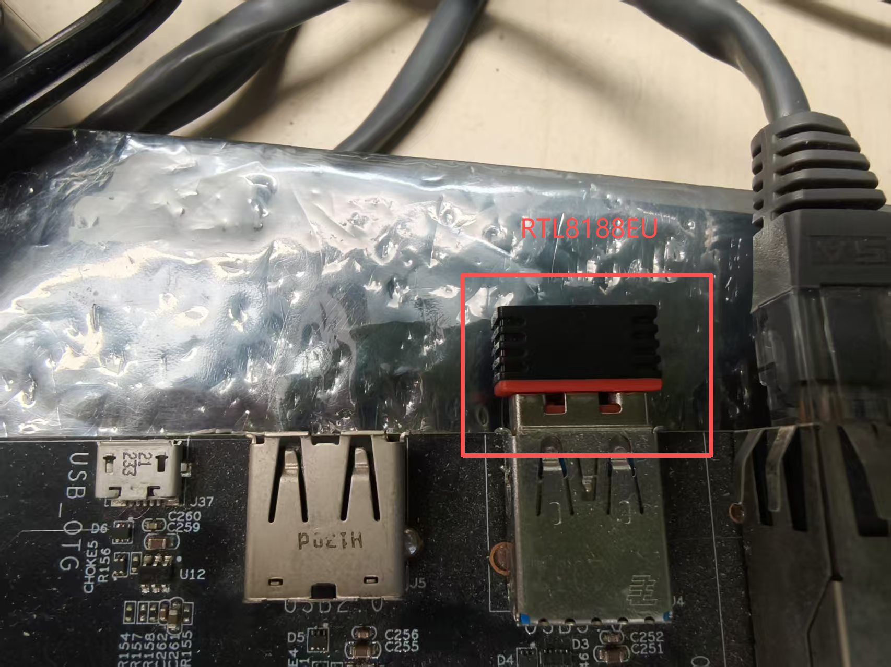

- - 9. 通过 XHCI 0  或 USB Hub 连接 WLAN 卡 （RTL8188EU）

- 实际测试过程中，连接以上全部的外设或者只连接其中部分的外设都可以进行相应的测试

#### 2.1.2 Phytium PI


- 其中，
- - 1. 通过 UART 1 串口连接控制台
- - 2. 通过 XMAC 0 连接网线对端
- - 3. 通过 SD 0 连接 MicroSD 卡
- - 4. 通过 XHCI 0 （支持 3.x 速率） 连接 USB 3.x Hub，再连接 USB 3.x U 盘、键盘、鼠标

- 实际测试过程中，连接以上全部的外设或者只连接其中部分的外设都可以进行相应的测试


#### 2.1.3 FT2004 DSK

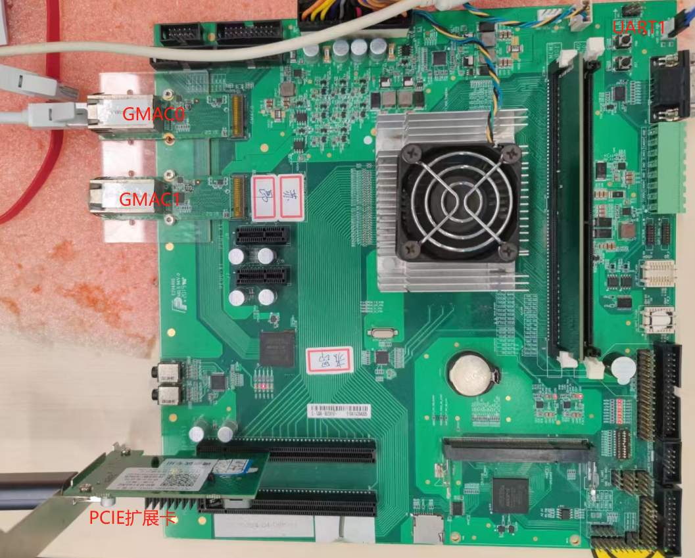

- 其中，
- - 1. 通过 UART 1 串口连接控制台
- - 2. 通过 GMAC 0 连接网线对端
- - 3. 通过 PCIe 通道连接 XHCI 扩展卡，连接 USB 2.x U 盘

- 实际测试过程中，连接以上全部的外设或者只连接其中部分的外设都可以进行相应的测试

#### 2.1.4 D2000 TEST

- 其中，
- - 1. 通过 UART 1 串口连接控制台
- - 2. 通过 GMAC 0 连接网线对端
- - 3. 通过 PCIe 通道连接 XHCI 扩展卡，连接 USB 2.x U 盘

- 实际测试过程中，连接以上全部的外设或者只连接其中部分的外设都可以进行相应的测试


### 2.2 SDK配置方法

><font size="1">依赖哪些驱动、库和第三方组件，如何完成配置（列出需要使能的关键配置项）</font><br />

#### 2.1.1 E2000D Demo

- 在 SDK 根目录编译 E2000D Demo 的 BSP 和 LibBSD

```
make e2000d_demo_aarch64_bsp
make e2000d_demo_aarch64_libbsd
```

#### 2.1.2 E2000Q Demo

- 在 SDK 根目录编译 E2000Q Demo 的 BSP 和 LibBSD

```
make e2000q_demo_aarch64_bsp
make e2000q_demo_aarch64_libbsd
```

#### 2.1.3 Phytium PI

- 在 SDK 根目录编译 Phytium PI 的 BSP 和 LibBSD

```
make phytium_pi_aarch64_bsp
make phytium_pi_aarch64_libbsd
```

#### 2.1.4 FT2004 DSK

- 在 SDK 根目录编译 FT2004 DSK 的 BSP 和 LibBSD

```
make ft2004_dsk_aarch64_bsp
make ft2004_dsk_aarch64_libbsd
```

#### 2.1.5 D2000 TEST

- 在 SDK 根目录编译 D2000 TEST 的 BSP 和 LibBSD

```
make d2000_test_aarch64_bsp
make d2000_test_aarch64_libbsd
```

#### 2.1.6 PD2308 Demo

- 在 SDK 根目录编译 PD2308 Demo 的 BSP 和 LibBSD

```
make pd2308_demo_bsp
make pd2308_demo_libbsd
```

#### 2.1.7 PD2408 TEST A

- 在 SDK 根目录编译 PD2408 TEST A 的 BSP 和 LibBSD

```
make pd2408_testa_bsp
make pd2408_testa_libbsd
```

### 2.3 构建和下载

><font size="1">描述构建、烧录下载镜像的过程，列出相关的命令</font><br />

- 选择目标平台的类型

> 对于 E2000D Demo，在 SDK 根目录下输入

```
source tools/env_e2000d_demo_aarch64.sh
```

> 对于 E2000Q Demo，在 SDK 根目录下输入

```
source tools/env_e2000q_demo_aarch64.sh
```

> 对于 Phytium PI，在 SDK 根目录下输入

```
source tools/env_phytium_pi_aarch64.sh
```

> 对于 FT2004 DSK，在 SDK 根目录下输入

```
source tools/env_ft2004_dsk_aarch64.sh
```

> 对于 D2000 TEST，在 SDK 根目录下输入

```
source tools/env_d2000_test_aarch64.sh
```

> 对于 PD2308 Demo，在 SDK 根目录下输入

```
source tools/env_pd2308_demo.sh
```

> 对于 PD2408 TEST A，在 SDK 根目录下输入

```
source tools/env_pd2408_testa.sh
```

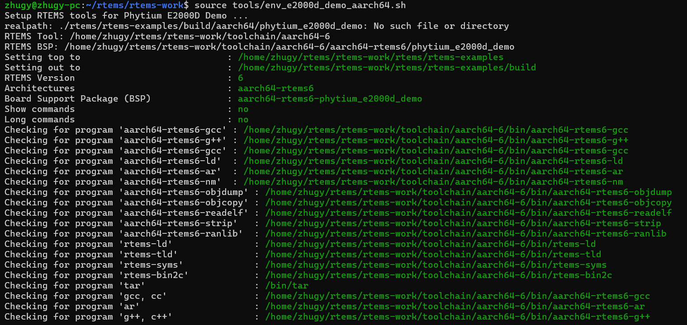

- 随后在当前 Shell 终端下进入例程，编译镜像

> 注意 source tools 目录脚本选择目标平台只对当前 Shell 终端有效

```
cd examples/rtems-libbsd
make clean image
```

- 默认编译生成的镜像会放置在 /mnt/d/tftpboot 目录下，可以通过 makefile 中的 USR_BOOT_DIR 修改镜像放置的目录

- BSP 和 LibBSD 没有修改的情况下，如果只修改本例程的代码，只需要编译本例程即可

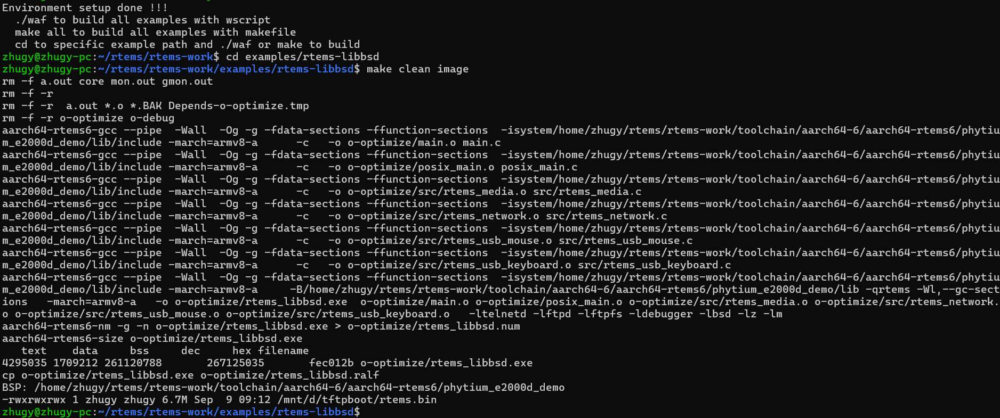

- 通过 tftpboot 将编译生成的镜像上传到开发板上

#### 2.3.1 开发板固件是 U-Boot 

- 如果是加载 elf 镜像 （编译输出的 *.exe 文件）

```
setenv ipaddr 192.168.4.20
setenv serverip 192.168.4.30
setenv gatewayip 192.168.4.1
tftpboot 0xd0100000 rtems.exe
bootelf -s 0xd0100000
```

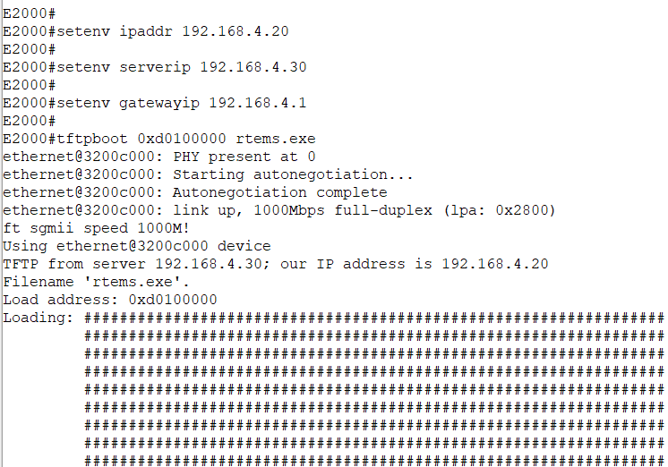

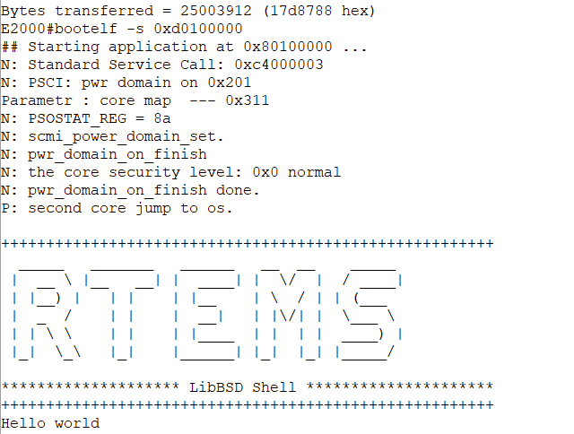

- 如果是加载 bin 镜像

```
setenv ipaddr 192.168.4.20
setenv serverip 192.168.4.30
setenv gatewayip 192.168.4.1
tftpboot 0x80100000 rtems.bin
dcache flush
go 0x80100000
```

> 部分固件可能没有命令 `dcache flush`，可以先尝试不 flush dcache 启动，如果启动失败的话需要联系 FAE 更换支持命令 `dcache flush`的固件

#### 2.3.2 开发板固件是 UEFI 

- 首先参考《UEFI启动RTOS使用手册v2.0》制作 UEFI 下启动 RTOS 的启动盘，然后引导进入 GRUB 界面，输入下面的命令加载启动 RTEMS 镜像

- 如果是加载 elf 镜像 （编译输出的 *.exe 文件）

```
net_add_addr tftp efinet0 192.168.4.20
net_add_route tftp 192.168.4.30 tftp
loadelf (tftp,192.168.4.30)/rtems.exe
boot
```

- 如果是加载 bin 镜像

```
net_add_addr tftp efinet0 192.168.4.20
net_add_route tftp 192.168.4.30 tftp
loadbin (tftp,192.168.4.30)/rtems.bin 0x80100000
boot
```

> 注意 E2000 UBOOT 和 UEFI 的默认启动核心可能不同，需要保证 Phytium BSP 中 bspcpuinfo.c 中的核心配置和实际情况一致才能启动成功

### 2.4 输出与实验现象

><font size="1">描述输入输出情况，列出存在哪些输出，对应的输出是什么（建议附录相关现象图片）</font><br />

#### 2.4.1 E2000D/Q Demo

##### Micro SD

- 启动过程中应该可以看到 SD 1 控制器的初始化信息

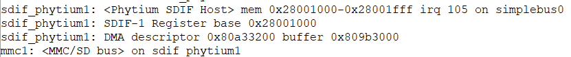

- SD 1 卡槽如果连接了 MicroSD 卡应该可以看到识别到卡的信息，形成设备实例 /dev/mmcsd-1，如果 MicroSD 卡上存在 FAT32 文件系统，可以看到 media listener 自动挂载文件系统到 /media/mmcsd-1 目录的过程

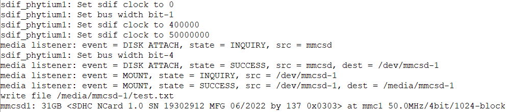

##### eMMC

- 启动过程中应该可以看到 SD 0 控制器的初始化信息
> E2000 eMMC 运行在 100MHz/66MHz 时可能需要调整引脚时序，可以在启动镜像前输入 `mw.l 0x32b31120 0x1f00;`

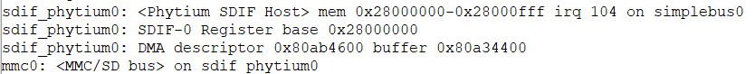

- SD 0 板载连接的 eMMC 应该也可以识别，形成设备实例 /dev/mmcsd-0，如果 eMMC 上存在 FAT32 文件系统，可以看到 media listener 自动挂载文件系统到 /media/mmcsd-0 目录的过程

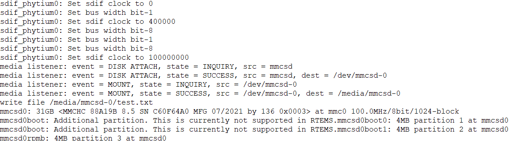

- 手动格式化和挂载 eMMC/SD卡

```
# 将块设备 /dev/mmcsd-0 格式化成 FAT32 格式
mkdos -V mmcsd0 -s 128 /dev/mmcsd-0

# 将格式化后的块设备挂载到目录 /media/mmcsd-0
mkdir -p /media/mmcsd-0
mount -t dosfs /dev/mmcsd-0 /media/mmcsd-0

# 读写文件系统
cd /media/mmcsd-0
time dd if=/dev/zero of=./image bs=1M count=10
time dd if=./image of=/dev/null bs=1M count=10

# 卸载文件系统
unmount /media/mmcsd-0
```

> RTEMS 的 FAT32 文件系统最多只支持单次读写 128 块数据，因此读写速度达不到最快 

##### XMAC

- 启动过程中应该可以看到 XMAC 0 控制器和 PHY 的初始化信息

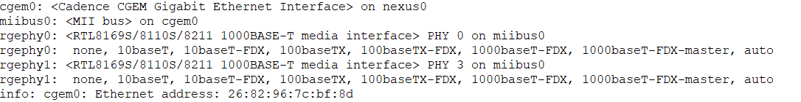

- 随后一段时间，可以看到链路配置的信息，以及 23 号端口上启动 Telnet 服务的提示

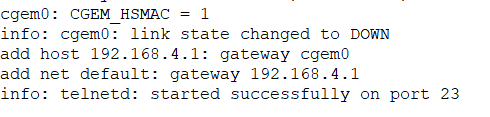

- 之后可以在串口终端查看网口的配置，默认地，开发板 ip 是 192.168.4.20，对端的 ip 是 192.168.4.50，相关的默认配置可以通过 configs/netconf 中对应平台的配置文件修改，也可以通过 ifconfig 命令手动修改

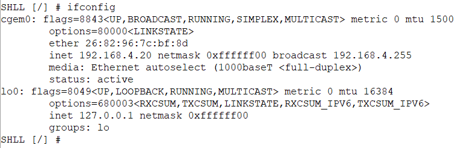

- 首先可以尝试从开发板侧 ping 对端主机

```
ping -c 20 192.168.4.50
```

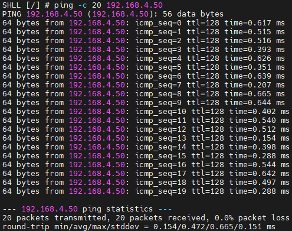

- 然后可以从对端主机 ping 开发板

```
ping 192.168.4.20
```

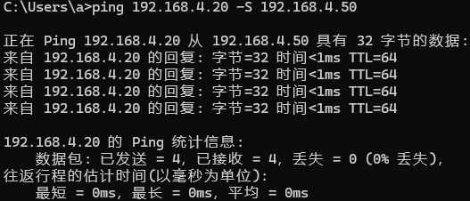

- 确认开发板和对端主机联通后，可以通过 23 号端口 telnet 登录开发板，进入 TLNT 控制台

```
telnet 192.168.4.20 23
```

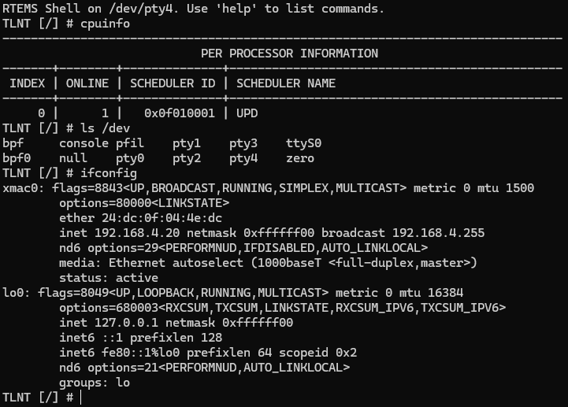

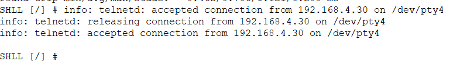

- 可以通过 ifconfig 手动修改 IP 地址，

```
ifconfig xmac0 192.168.4.10 netmask 255.255.255.0 up
```

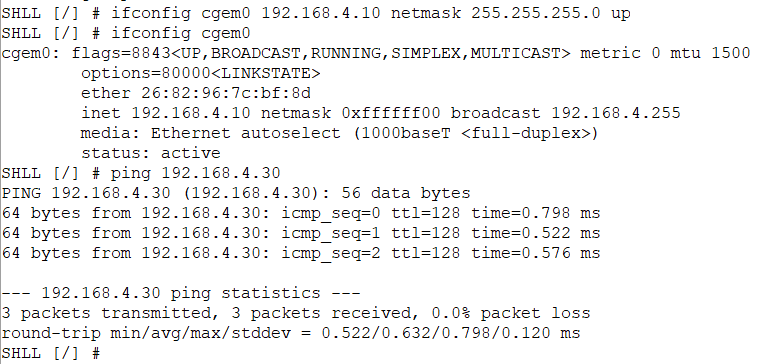

##### XHCI (平台)

- 启动后应该可以看到 XHCI 0 和 XHCI 1 控制器的初始化信息

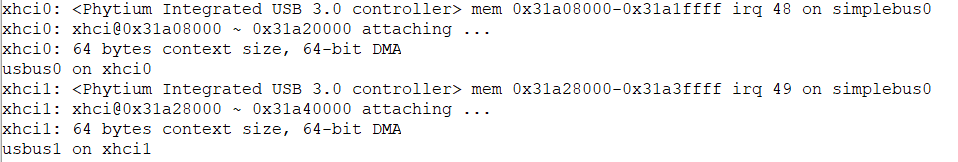

- 随后可以看到 XHCI roothub 的初始化

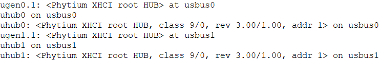

- 之后开始枚举 USB 设备，首先依次是外扩的 USB Hub，以及上来连接的键盘鼠标和U盘，可以看到 /dev/ukbd0 是键盘，/dev/ums0 是鼠标，/dev/umass-sim-0 是 U 盘

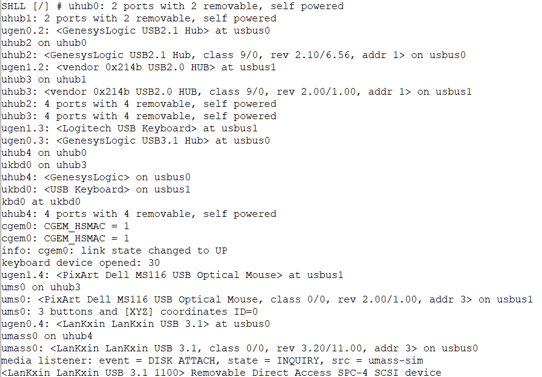
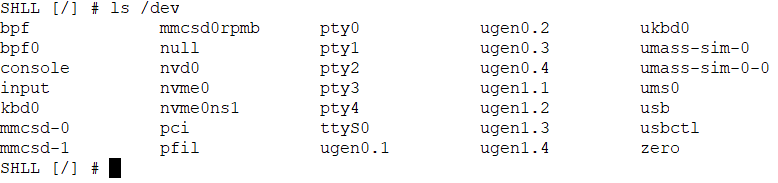

- 如果 U 盘上有 FAT32 文件系统，会自动挂载到 /dev/umass-sim-0 目录下

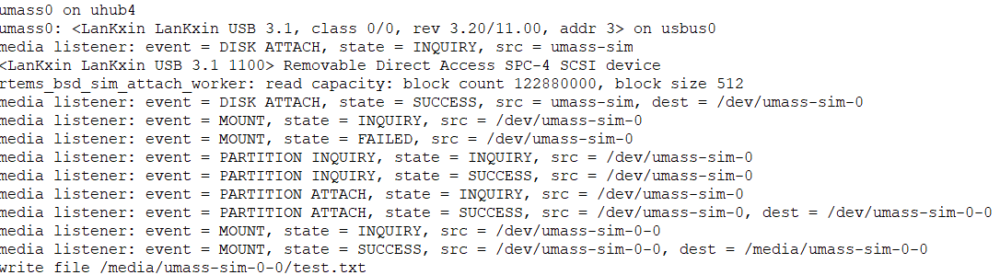

- 随后可以用连接的 USB 键盘进行输入

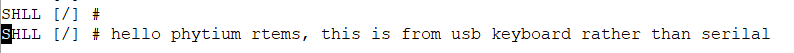

- 通过 USB 鼠标进行输入

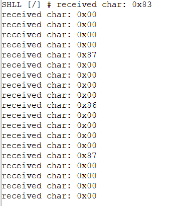

##### XHCI（PCIe）

- 启动过程中可以看到 PCI XHCI 控制器初始化

##### NVMe (PCIe)

- 启动过程中可以看到 NVMe 盘的识别，对应设备 /dev/nvd0

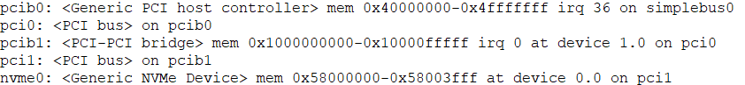

- 如果 NVMe 盘存在 FAT32 文件系统，可以看到自动挂载到 /media/nvd0 目录的信息

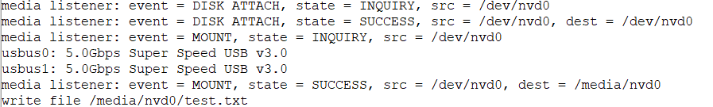

- 通过 df 命令可以查看各个块设备的容量的使用情况

```
df -h
```

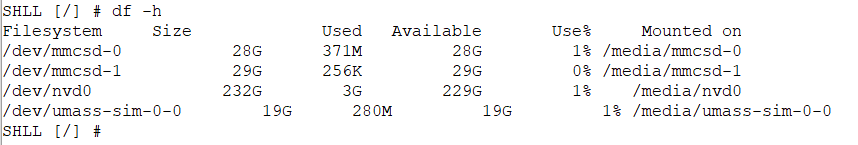

- 退出 RTEMS 系统可以通过 reset 命令完成，重启后回到 Uboot 界面

```
reset
```

#### WLAN RTL8188EU (XHCI)

- 在 rtems_wlan.c 的 wlan_create_wpa_supplicant_conf 中指定需要连接的 WLAN 热点和连接密码，默认是 SSID=phytium_net WPA-PSK=phytium-net

- 启动过程中可以看到 RTL8188EU 的识别信息

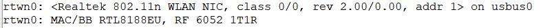

- 启动后查看无线网卡的连接情况

```
ifconfig wlan0
```

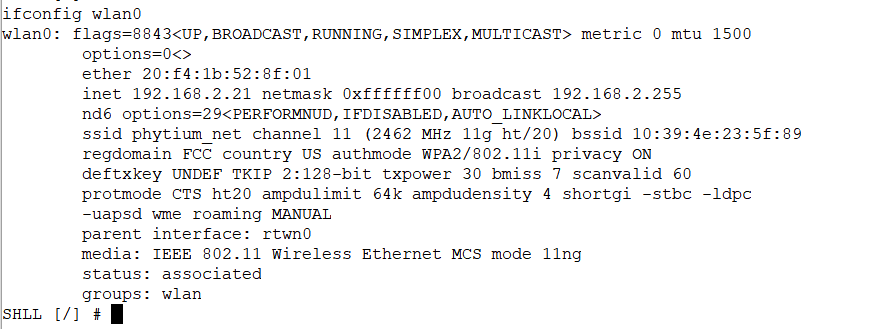

- 和 WLAN 局域网内的的其它主机互 ping

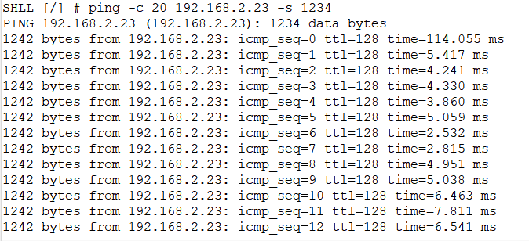

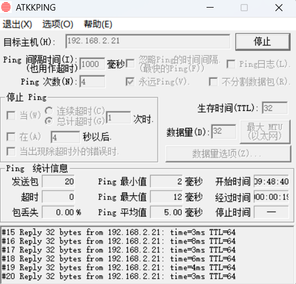

#### 2.4.2 PhytiumPI

##### Micro SD

- Phytium PI 中 Micro SD 连接在 SD 0 控制器上，默认会放置固件，可以在固件后面，偏移量大于 64MB 的位置预留分区制作一个 FAT32 文件系统给 RTEMS 使用

- 启动后可以看到 SD 0 控制器和 Micro SD 卡的识别信息

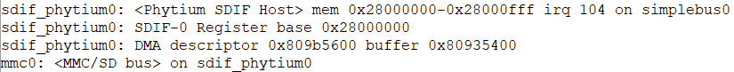

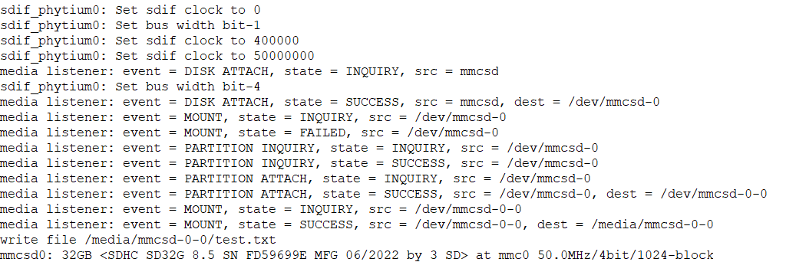

- 由于 FAT32 文件系统是在分区中，对应的块设备会识别为 /dev/mmcsd-0-0，自动挂载目录为 /media/mmcsd-0-0

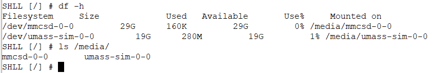

##### XMAC

- Phytium PI 的两个网口，XMAC 0 和 XMAC 1 都引出可以使用，初始化时可以看到对应信息

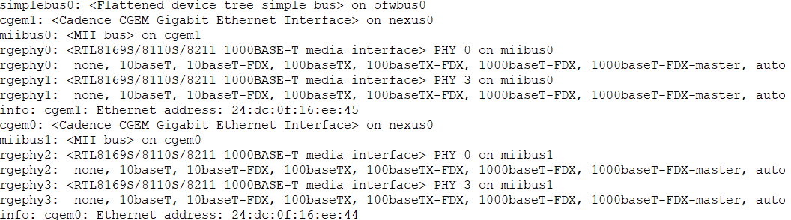

- 两个网口对应 xmac0 和 xmac1 设备实例

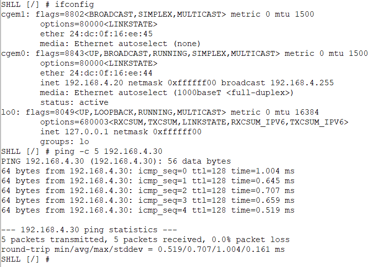

##### XHCI (平台)

- Phytium PI 只引出了 XHCI 0，在板子正面靠近网口的插槽，可以通过 Hub 同时使用键盘、鼠标和 U 盘，具体的使用方法和 E2000 D/Q Demo 中的介绍一致

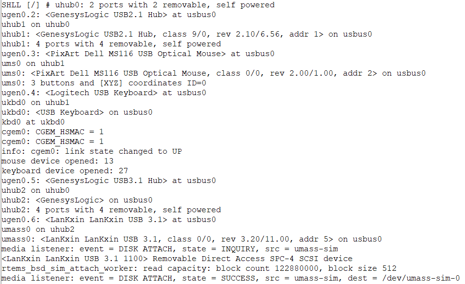


#### 2.4.3 FT2004 DSK

##### XHCI（PCIe）

- 启动过程中可以看到 PCI XHCI 控制器初始化


#### 2.4.4 D2000 TEST

##### GMAC

- 启动过程中可以看到网卡初始化

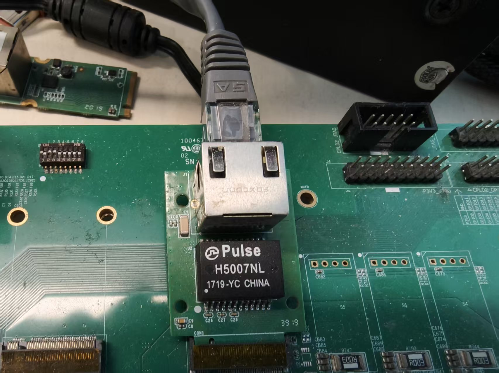

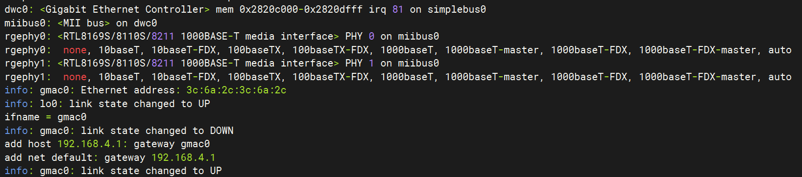

- 使用 ifconfig 查看网卡信息

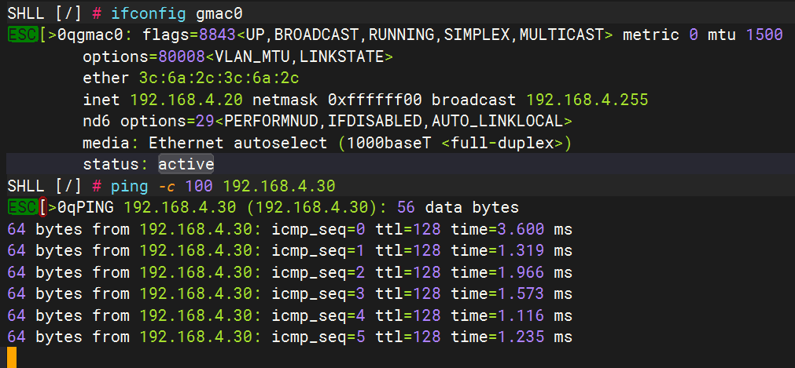

##### XHCI（PCIe）

- 启动过程中可以看到 PCI XHCI 控制器初始化

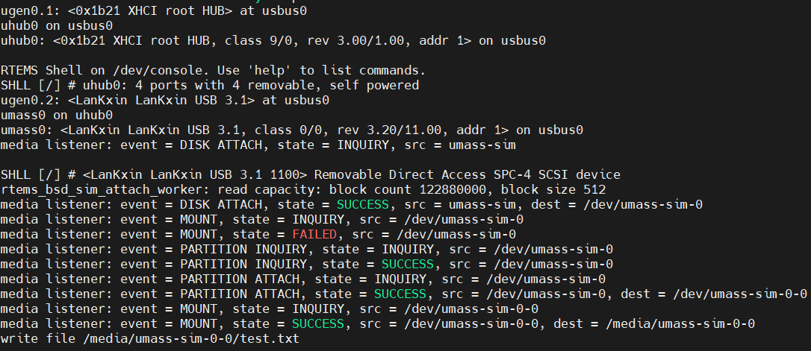

#### 2.4.5 PD2308 DEMO

##### SD

- 启动过程可以看到识别的 SD 卡

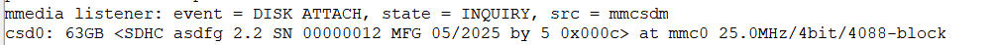

##### XMAC

- 启动后可以看到网卡设备

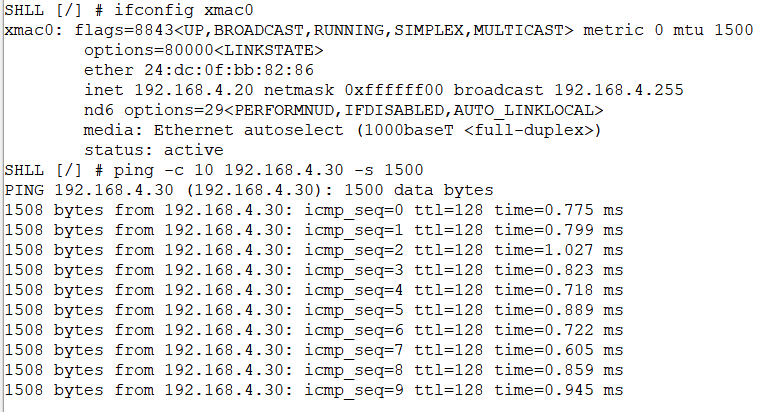

##### XHCI

- 启动后可以看到 PCIe XHCI 控制器上挂载的 USB 设备

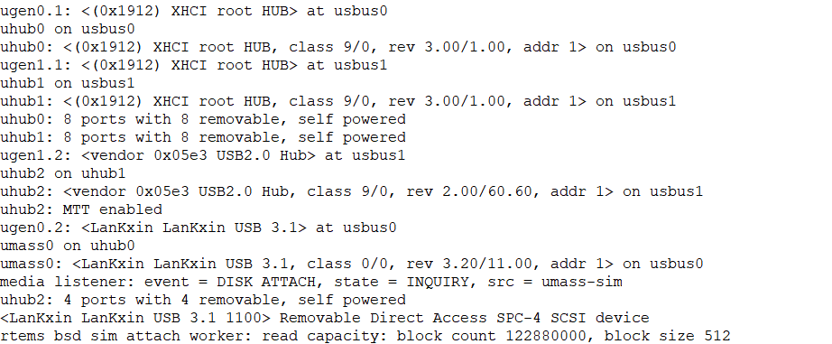

#### 2.4.6 PD2408 TEST

##### eMMC

- 启动过程可以看到识别到 eMMC 设备

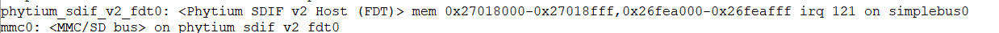

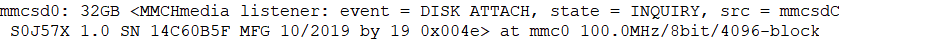

- 格式化 eMMC 然后挂载文件系统

```
# 将块设备 /dev/mmcsd-0 格式化成 FAT32 格式
mkdos -V mmcsd0 -s 128 /dev/mmcsd-0

# 将格式化后的块设备挂载到目录 /media/mmcsd-0
mkdir -p /media/mmcsd-0
mount -t dosfs /dev/mmcsd-0 /media/mmcsd-0

# 读写文件系统
cd /media/mmcsd-0
time dd if=/dev/zero of=./image bs=1M count=100
time dd if=./image of=/dev/null bs=1M count=100

# 卸载文件系统
unmount /media/mmcsd-0
```

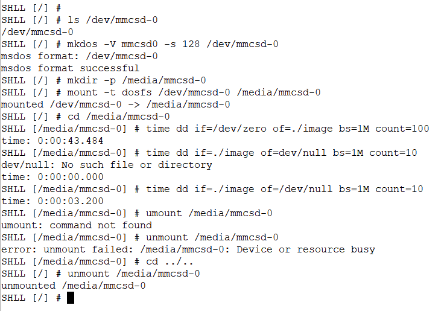

##### XMAC MSG

- 启动过程中可以看到网卡设备的初始化信息

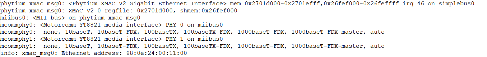

- 启动完成后可以查看网卡信息

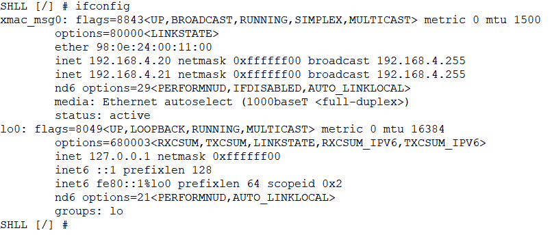


## 3. 如何解决问题

><font size="1">主要记录使用例程中可能会遇到的问题，给出相应的解决方案</font><br />

## 4. 修改历史记录

><font size="1">记录例程的重大修改记录，标明修改发生的版本号 </font><br />

