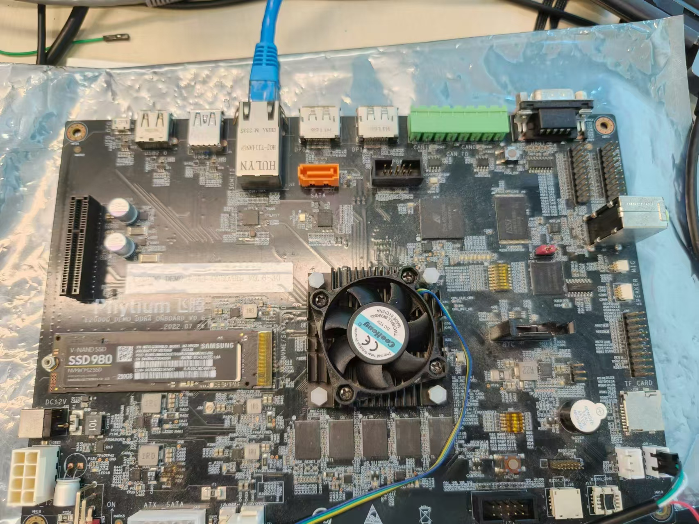
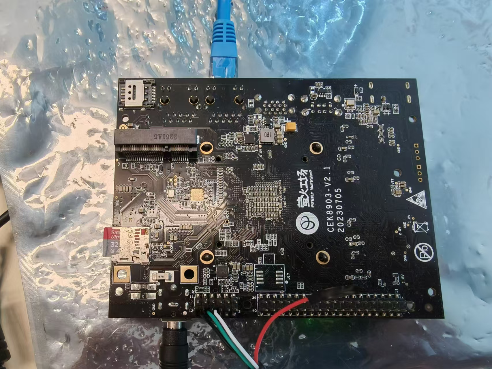
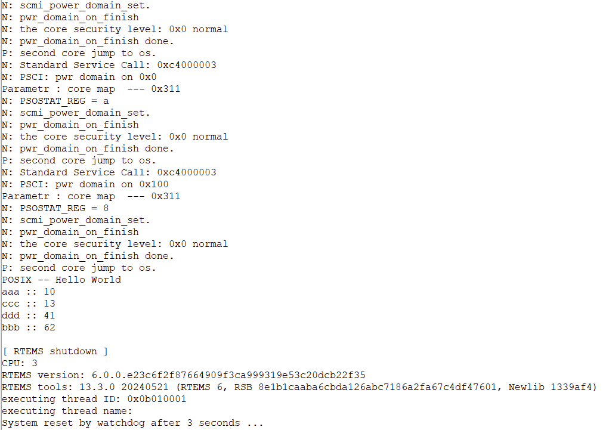
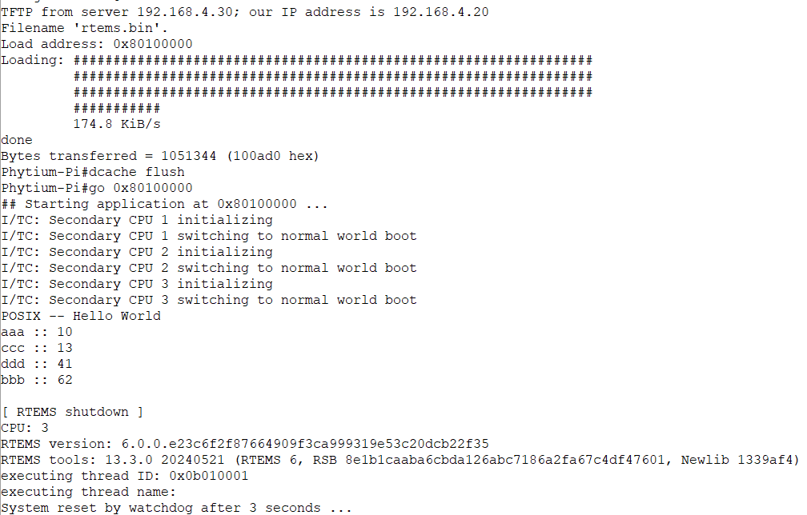

# RTEMS 内核测试

## 1. 例程介绍

><font size="1">介绍例程的用途，使用场景，相关基本概念，描述用户可以使用例程完成哪些工作</font><br />

本例程示范了 RTEMS 内核基本功能的使用:

- 此例程已在 E2000 D/Q Demo 板上完成测试
- 此例程已在 Phytium PI 上完成测试

## 2. 如何使用例程

><font size="1">描述开发平台准备，使用例程配置，构建和下载镜像的过程</font><br />

本例程需要以下硬件，

- E2000D/Q Demo 板
- 串口线和串口上位机

### 2.1 硬件配置方法

><font size="1">哪些硬件平台是支持的，需要哪些外设，例程与开发板哪些IO口相关等（建议附录开发板照片，展示哪些IO口被引出）</font><br />

#### 2.1.1 E2000D/Q Demo

- 如图所示连接硬件



- 实际测试过程中，至少连接上述外设，连接更多外设应该也不影响工作

#### 2.1.2 Phytium PI

- 如图所示连接硬件



- 实际测试过程中，至少连接上述外设，连接更多外设应该也不影响工作

### 2.2 SDK配置方法

><font size="1">依赖哪些驱动、库和第三方组件，如何完成配置（列出需要使能的关键配置项）</font><br />

#### 2.1.1 E2000D Demo

- 在 SDK 根目录编译 E2000D Demo 的 BSP

```
make e2000d_demo_aarch64_bsp
```

#### 2.1.2 E2000Q Demo

- 在 SDK 根目录编译 E2000Q Demo 的 BSP

```
make e2000q_demo_aarch64_bsp
```

#### 2.1.3 Phytium PI

- 在 SDK 根目录编译 Phytium PI 的 BSP

```
make phytium_pi_aarch64_bsp
```

### 2.3 构建和下载

><font size="1">描述构建、烧录下载镜像的过程，列出相关的命令</font><br />

- 选择目标平台的类型

> 对于 E2000D Demo，在 SDK 根目录下输入

```
source tools/env_e2000d_demo_aarch64.sh
```

> 对于 E2000Q Demo，在 SDK 根目录下输入

```
source tools/env_e2000q_demo_aarch64.sh
```

> 对于 Phytium PI，在 SDK 根目录下输入

```
source tools/env_phytium_pi_aarch64.sh
```

- 随后在当前 Shell 终端下进入例程，编译镜像

> 注意 source tools 目录脚本选择目标平台只对当前 Shell 终端有效

```
cd examples/rtems
make clean image
```

- 默认编译生成的镜像会放置在 /mnt/d/tftpboot 目录下，可以通过 makefile 中的 USR_BOOT_DIR 修改镜像放置的目录

- 通过 tftpboot 将编译生成的镜像上传到开发板上
- 如果是加载 elf 镜像 （编译输出的 *.exe 文件）

```
setenv ipaddr 192.168.4.20
setenv serverip 192.168.4.30
setenv gatewayip 192.168.4.1
tftpboot 0xd0100000 rtems.exe
bootelf -s 0xd0100000
```

- 如果是加载 bin 镜像

```
setenv ipaddr 192.168.4.20
setenv serverip 192.168.4.30
setenv gatewayip 192.168.4.1
tftpboot 0x80100000 rtems.bin
dcache flush
go 0x80100000
```

### 2.4 输出与实验现象

><font size="1">描述输入输出情况，列出存在哪些输出，对应的输出是什么（建议附录相关现象图片）</font><br />

#### 2.4.1 E2000D/Q Demo

- 启动全部四个核心后，打印 Hello World，然后调用 C++ 标准库中的 std::map 进行打印，完成工作后系统关闭



#### 2.4.2 Phytium PI

- 启动全部四个核心后，打印 Hello World，然后调用 C++ 标准库中的 std::map 进行打印，完成工作后系统关闭



## 3. 如何解决问题

><font size="1">主要记录使用例程中可能会遇到的问题，给出相应的解决方案</font><br />

## 4. 修改历史记录

><font size="1">记录例程的重大修改记录，标明修改发生的版本号 </font><br />

